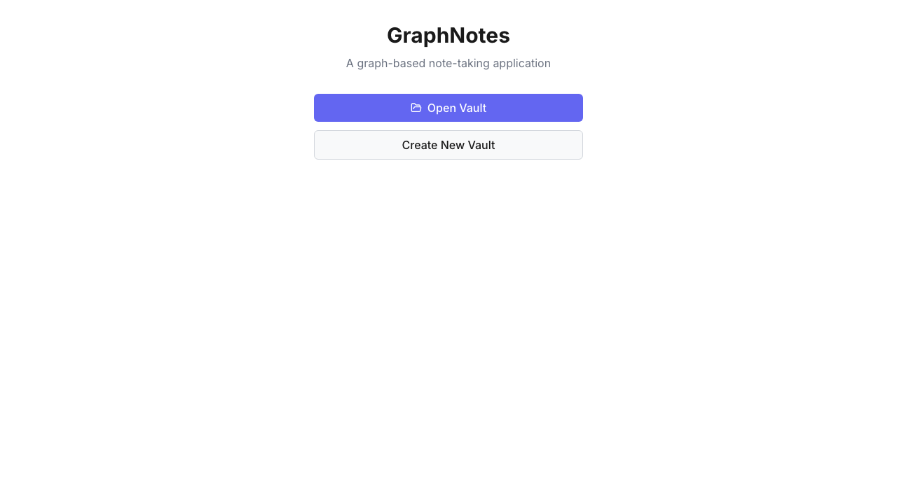
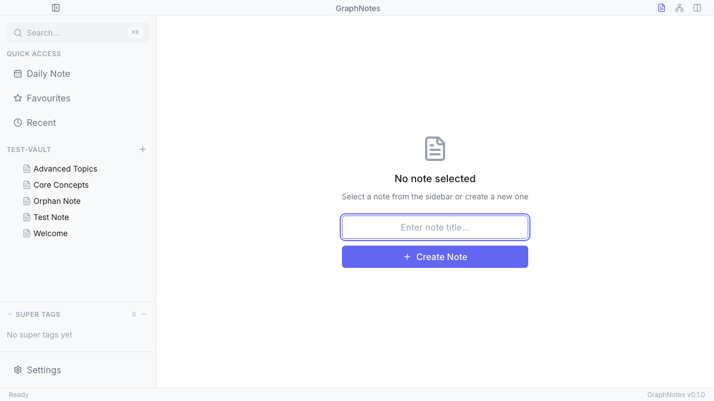
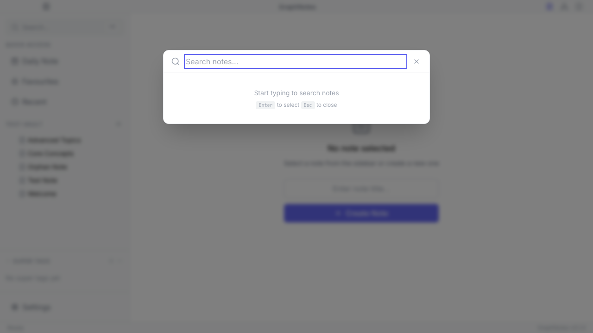
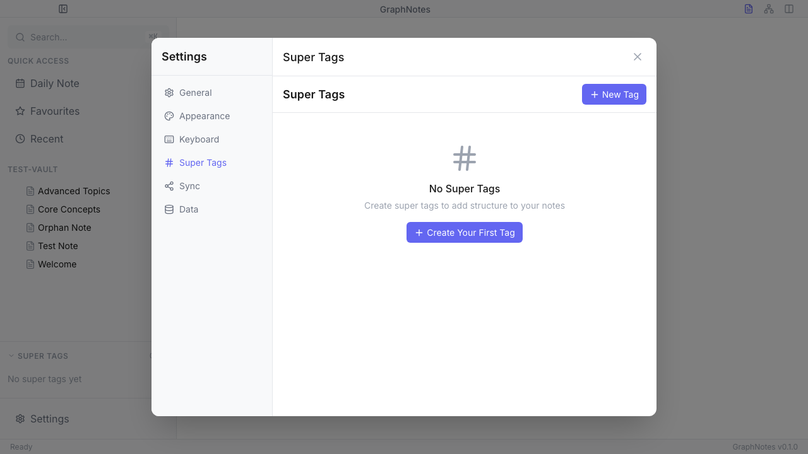
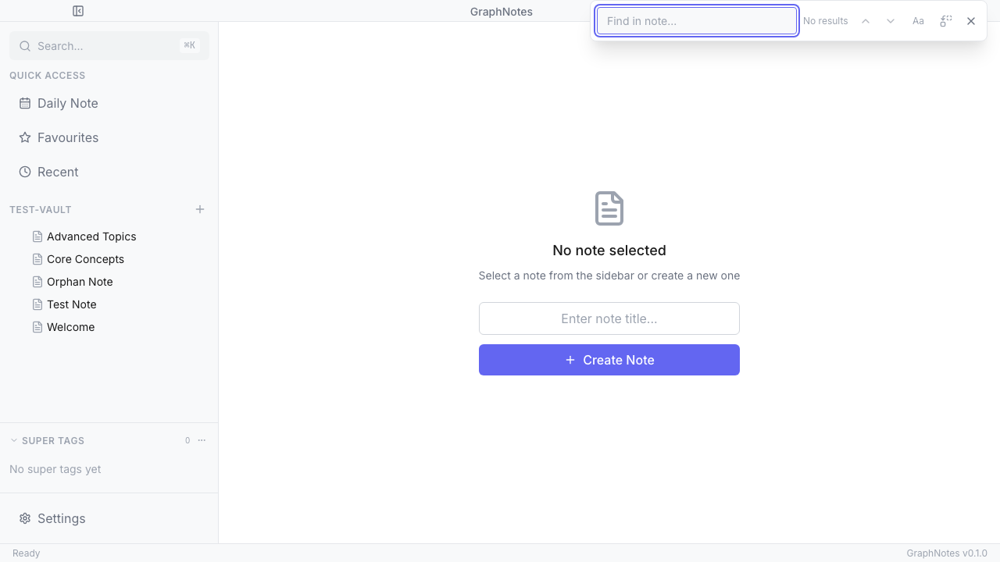
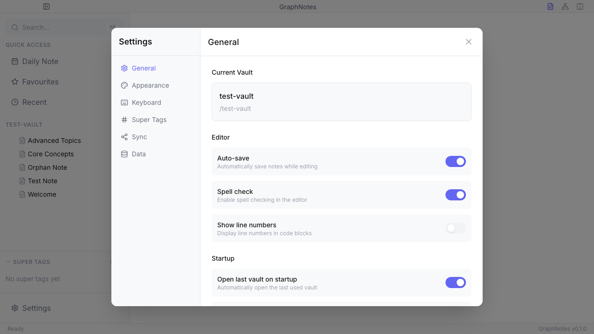
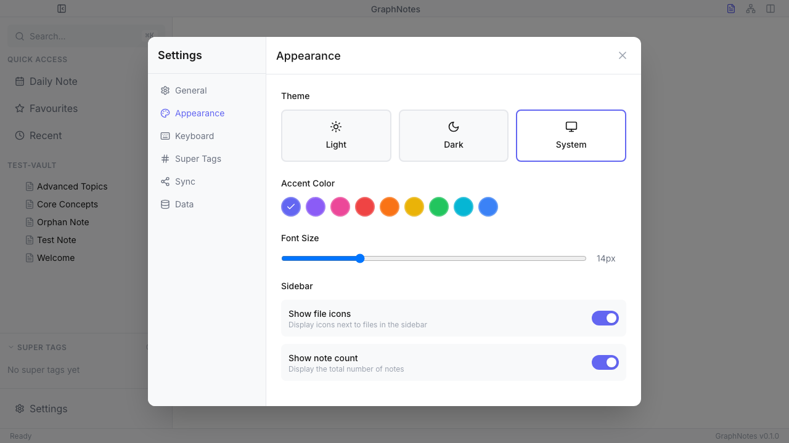

# GraphNotes User Manual

**Version 0.1.0**

GraphNotes is a graph-based note-taking application that helps you organize your thoughts, create connections between ideas, and visualize your knowledge as an interconnected graph.

---

## Table of Contents

1. [Getting Started](#getting-started)
2. [The Main Interface](#the-main-interface)
3. [Working with Vaults](#working-with-vaults)
4. [Creating and Editing Notes](#creating-and-editing-notes)
5. [Linking Notes](#linking-notes)
6. [Graph View](#graph-view)
7. [Quick Search](#quick-search)
8. [Super Tags](#super-tags)
9. [Properties Panel](#properties-panel)
10. [Backlinks Panel](#backlinks-panel)
11. [Find in Note](#find-in-note)
12. [Daily Notes](#daily-notes)
13. [Settings](#settings)
14. [Keyboard Shortcuts](#keyboard-shortcuts)
15. [Data Management](#data-management)

---

## Getting Started

### First Launch

When you first open GraphNotes, you'll see the **Vault Selector** screen:



From here you can:
- **Open Vault**: Browse and select an existing folder containing your notes
- **Create New Vault**: Create a fresh vault in a new location

### What is a Vault?

A vault is simply a folder on your computer that contains your notes. All your notes are stored as standard Markdown files (`.md`), making them portable and accessible by any text editor.

---

## The Main Interface

After opening a vault, you'll see the main GraphNotes interface:


The interface consists of:

### 1. Title Bar
- **Toggle Sidebar**: Collapse/expand the sidebar (top-left icon)
- **App Title**: "GraphNotes" centered
- **View Toggles**: Switch between Editor, Graph, and Split views (top-right icons)

### 2. Sidebar (Left Panel)
- **Search Bar**: Quick access to search (`⌘K`)
- **Quick Access**:
  - Daily Note
  - Favourites
  - Recent
- **Vault File Tree**: Browse all notes in your vault
- **Super Tags**: View and manage your tag categories
- **Settings**: Access application settings

### 3. Editor Area (Center)
- Rich text editor for writing notes
- Toolbar with formatting options
- Properties and Links buttons

### 4. Status Bar (Bottom)
- Shows "Ready" when idle
- Displays version number (bottom-right)

---

## Working with Vaults

### Opening a Vault

1. Click **Open Vault** on the welcome screen
2. Browse to select a folder
3. GraphNotes will index all Markdown files in that folder

### Creating a New Note

There are several ways to create a new note:

1. **Quick Create**: Enter a title in the "Enter note title..." field and click **+ Create Note**
2. **Plus Button**: Click the `+` button next to your vault name in the sidebar
3. **Keyboard Shortcut**: Use `⌘N` (Mac) or `Ctrl+N` (Windows/Linux)

### File Tree Navigation

The sidebar shows all notes in your vault organized alphabetically:
- Click a note to open it in the editor
- Right-click a note for context menu options:
  - Open
  - Rename
  - Duplicate
  - Delete

---

## Creating and Editing Notes

### The Editor

GraphNotes uses a rich text editor that supports Markdown formatting:



### Formatting Options

The editor toolbar provides quick formatting:
- **Bold** (`⌘B`)
- **Italic** (`⌘I`)
- **Headings** (H1, H2, H3)
- **Lists** (bullet, numbered, checklist)
- **Code blocks**
- **Links**
- **Quotes**

### Auto-Save

Notes are automatically saved as you type. Look for the "Saved" indicator in the toolbar to confirm your changes are persisted.

### Editor Dropdown Menu

Click the **More options** button (three dots) in the toolbar to access:
- Properties panel
- Backlinks panel
- Find in note
- Duplicate note
- Delete note

---

## Linking Notes

### Creating Wiki-style Links

Connect your notes by creating links using double brackets:

```
Check out my [[Other Note]] for more details.
```

When you type `[[`, a suggestion dropdown appears with matching notes from your vault.

### Link Types

GraphNotes supports named links with custom styling:
- Basic links: `[[Note Name]]`
- Named links with colors and custom display text

### Viewing Links

Open the **Links** panel (toolbar) to see:
- **Outgoing Links**: Notes this note links to
- **Backlinks**: Notes that link to this note

---

## Graph View

Visualize your notes as an interconnected graph:


### Accessing Graph View

- Click the **Graph** icon in the title bar
- Or use the keyboard shortcut

### Graph Controls

- **Search**: Find specific nodes in the graph
- **Layout Options**:
  - Force (physics-based)
  - Grid
  - Tree
  - Radial
- **Filters**: Show/hide nodes based on criteria
- **Zoom**: Use mouse scroll or control buttons
- **Minimap**: Overview of entire graph (bottom-right)

### Interacting with Nodes

- **Click**: Select a node
- **Double-click**: Open the note in the editor
- **Hover**: See node tooltip with preview
- **Drag**: Reposition nodes

### Graph Edges

Lines between nodes represent links. The thickness and color can indicate:
- Link frequency
- Link type (if using named links)
- Bidirectional vs. one-way links

---

## Quick Search

Access your notes instantly with the quick search modal:



### Opening Quick Search

- Click the search bar in the sidebar
- Press `⌘K` (Mac) or `Ctrl+K` (Windows/Linux)

### Using Quick Search

1. Start typing to search note titles
2. Results appear instantly as you type
3. Press `Enter` to open the selected note
4. Press `Esc` to close

### Search Features

- Searches note titles
- Shows matching results in real-time
- Navigate results with arrow keys

---

## Super Tags

Super Tags add structure to your notes with custom fields and styling:



### What are Super Tags?

Super Tags are like templates for categorizing notes. Each Super Tag can have:
- Custom name and color
- Icon
- Custom attributes (fields) like dates, statuses, priorities

### Creating a Super Tag

1. Open **Settings** → **Super Tags**
2. Click **+ New Tag** or **Create Your First Tag**
3. Configure:
   - **Name**: e.g., "Project", "Person", "Book"
   - **Color**: Choose from preset colors
   - **Icon**: Optional emoji or symbol
   - **Attributes**: Add custom fields

### Attribute Types

- **Text**: Free-form text
- **Number**: Numeric values
- **Date**: Date picker
- **Select**: Dropdown options
- **Checkbox**: Boolean toggle
- **URL**: Web links

### Assigning Super Tags to Notes

1. Open a note
2. Click **Properties** in the toolbar
3. In the Super Tags section, click **Add Tag**
4. Select the tag to assign
5. Fill in any attribute values

### Viewing Tagged Notes

The sidebar shows all Super Tags with counts of how many notes use each tag.

---

## Properties Panel

View and edit note metadata:

### Opening Properties

- Click **Properties** button in the editor toolbar
- Or select from the dropdown menu

### Available Properties

- **Note ID**: Unique identifier
- **Title**: Note title
- **Created**: Creation timestamp
- **Modified**: Last modification time
- **File Path**: Location in vault

### Super Tags Section

Manage which Super Tags are assigned to the note and fill in attribute values.

### Statistics

- **Words**: Total word count
- **Characters**: Character count
- **Lines**: Line count
- **Links**: Number of links in note

---

## Backlinks Panel

Discover connections to the current note:

### Opening Backlinks

- Click **Links** button in the editor toolbar

### Panel Sections

- **Outgoing Links**: Notes referenced by the current note
- **Backlinks**: Notes that reference the current note

### Using Backlinks

Click any link in the panel to navigate to that note.

---

## Find in Note

Search within the current note:



### Opening Find

- Press `⌘F` (Mac) or `Ctrl+F` (Windows/Linux)
- Or select from the editor dropdown menu

### Find Features

- **Search field**: Enter text to find
- **Results count**: Shows "X results" or "No results"
- **Navigation**: Up/down arrows to jump between matches
- **Match case**: Toggle case sensitivity
- **Replace mode**: Toggle to show replace field

### Replace Text

1. Open Find (`⌘F`)
2. Click the replace toggle
3. Enter search and replacement text
4. Click replace for single or replace all

---

## Daily Notes

Quickly capture daily thoughts and tasks:

### Opening Today's Note

- Click **Daily Note** in the Quick Access section
- Notes are created with today's date as the title

### Daily Note Format

Daily notes are automatically named with the format `YYYY-MM-DD` (e.g., `2025-12-05`).

---

## Settings

Access all application settings:



### Opening Settings

- Click **Settings** at the bottom of the sidebar
- Press `⌘,` (Mac) or `Ctrl+,` (Windows/Linux)

### Settings Tabs

#### General
- **Current Vault**: View active vault info
- **Editor Options**:
  - Auto-save (on/off)
  - Spell check (on/off)
  - Show line numbers (on/off)
- **Startup Options**:
  - Open last vault on startup
  - Open daily note on startup

#### Appearance


- **Theme**: Light, Dark, or System (follows OS)
- **Accent Color**: Choose from 9 color options
- **Font Size**: Adjust editor font size (12-20px)
- **Sidebar Options**:
  - Show file icons
  - Show note count

#### Keyboard
View and customize keyboard shortcuts.

#### Super Tags
Create and manage Super Tags (see [Super Tags](#super-tags) section).

#### Sync
Configure peer-to-peer synchronization between devices.

#### Data
- **Export**: Export notes as Markdown, HTML, or JSON
- **Import**: Import from Obsidian or Markdown files
- **Vault Statistics**: View totals for notes, links, tags, size
- **Danger Zone**: Clear event log, reset settings

---

## Keyboard Shortcuts

### Global Shortcuts

| Action | Mac | Windows/Linux |
|--------|-----|---------------|
| Quick Search | `⌘K` | `Ctrl+K` |
| New Note | `⌘N` | `Ctrl+N` |
| Save Note | `⌘S` | `Ctrl+S` |
| Settings | `⌘,` | `Ctrl+,` |
| Toggle Sidebar | `⌘\` | `Ctrl+\` |

### Editor Shortcuts

| Action | Mac | Windows/Linux |
|--------|-----|---------------|
| Bold | `⌘B` | `Ctrl+B` |
| Italic | `⌘I` | `Ctrl+I` |
| Underline | `⌘U` | `Ctrl+U` |
| Find | `⌘F` | `Ctrl+F` |
| Select All | `⌘A` | `Ctrl+A` |
| Undo | `⌘Z` | `Ctrl+Z` |
| Redo | `⌘⇧Z` | `Ctrl+Shift+Z` |

### Navigation Shortcuts

| Action | Mac | Windows/Linux |
|--------|-----|---------------|
| Close Modal | `Esc` | `Esc` |
| Navigate Search Results | `↑` `↓` | `↑` `↓` |
| Open Selected | `Enter` | `Enter` |

---

## Data Management

### File Format

All notes are stored as standard Markdown files with YAML frontmatter:

```markdown
---
id: "unique-id-123"
title: "My Note Title"
created: "2025-12-05T10:30:00Z"
modified: "2025-12-05T14:45:00Z"
superTags: ["project"]
links: []
---

# My Note Title

Note content goes here...
```

### Vault Structure

```
my-vault/
├── .graphnotes/           # GraphNotes config folder
│   ├── config.json        # Vault configuration
│   └── supertags/         # Super Tag definitions
├── note-1.md
├── note-2.md
├── daily/                 # Optional: organize daily notes
│   └── 2025-12-05.md
└── projects/              # Optional: folder organization
    └── project-a.md
```

### Export Options

- **Markdown**: Export notes as-is (portable)
- **HTML**: Export as formatted web pages
- **JSON**: Export graph data for analysis

### Import Options

- **From Obsidian**: Import existing Obsidian vaults
- **From Markdown**: Import any folder of `.md` files

### Backup Recommendations

Since all notes are plain Markdown files:
1. Use your preferred backup solution
2. Store vaults in cloud-synced folders (Dropbox, iCloud, etc.)
3. Use Git for version control

---

## Tips and Best Practices

### Organizing Your Vault

1. **Use folders** for broad categories (projects, areas, resources)
2. **Use Super Tags** for cross-cutting classifications
3. **Link liberally** to build connections
4. **Review the graph** periodically to find orphan notes

### Writing Effective Notes

1. **One idea per note** keeps things atomic
2. **Use descriptive titles** for easier searching
3. **Add links** while writing, not as an afterthought
4. **Tag consistently** with Super Tags

### Building Your Knowledge Graph

1. Start with daily notes to capture ideas
2. Extract permanent notes from daily notes
3. Connect new notes to existing ones
4. Use the graph view to discover patterns

---

## Troubleshooting

### Notes Not Appearing

- Ensure files have `.md` extension
- Check file permissions
- Restart the application

### Graph Not Loading

- Large vaults may take time to render
- Try filtering to reduce visible nodes
- Check for circular links causing issues

### Sync Issues

- Verify network connectivity
- Check sync settings configuration
- Review sync status panel for errors

---

## Getting Help

- **GitHub Issues**: Report bugs and request features
- **Documentation**: Check for updated guides online
- **Community**: Join discussions with other users

---

*GraphNotes v0.1.0 - A graph-based note-taking application*
